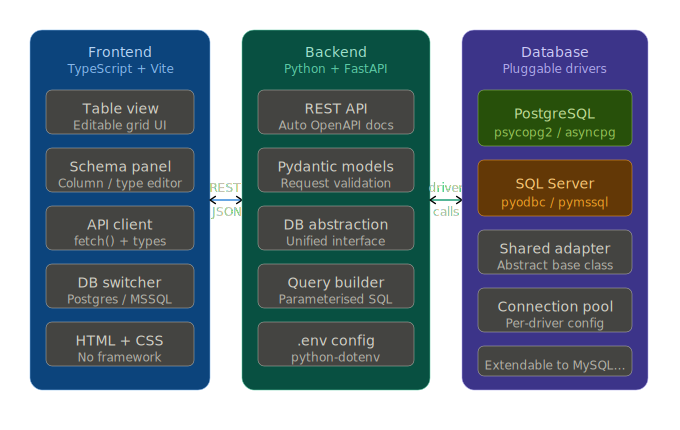
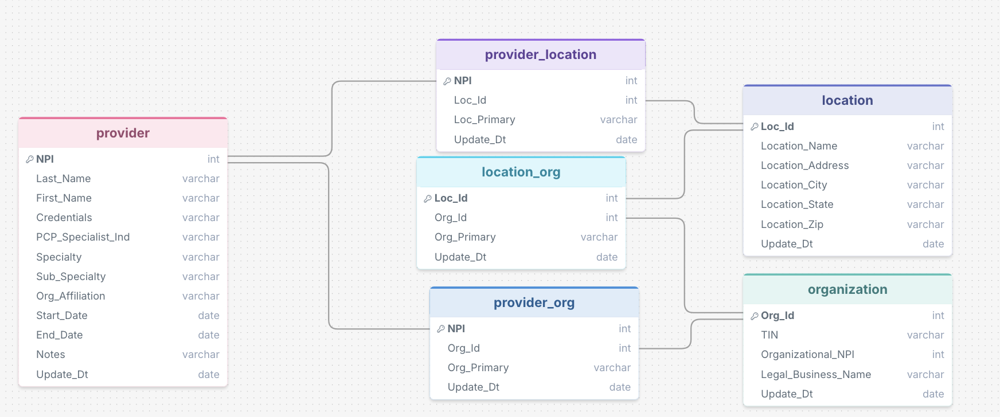

# Open Access
## Microsoft Access *Like* App

## Overview
### Summary:
- App that non-technical users can use to make updates to database tables with new or updated information. Scenario where this is applicable at work: Co-worker needs to update a healthcare provider table with up to date information (practice, term date, etc.) for each provider. She would benefit from an easy to use app where you can search providers and update values, or insert information for new providers. Right now, this is something possible, but in Microsoft Access, which I do not like personally. This app aims to be better for the specific case scenario.

### Goals:
- Functional app with features allowing for easy database table manipulation and search
- Well designed modern frontend user view
- Backend written in python

### Status:
- Early development

